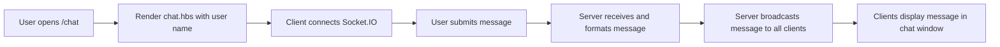

# Blog Site

A Node.js + Express blogging app with user authentication, post management, comments, and real-time chat.

## Features

- User signup, login, logout
- JWT-based authentication stored in a cookie
- Create, edit, publish, and delete blog posts
- Comment on blog posts
- View user profiles and published posts
- Real-time chat using Socket.IO
- Handlebars (`hbs`) templates with partials
- MongoDB persistence via Mongoose

## Project Structure

- `package.json` - project dependencies and start scripts
- `src/app.js` - Express app, routes, Socket.IO setup, view engine, middleware
- `src/index.js` - app entry point that starts the HTTP server
- `src/db/mongoose.js` - MongoDB connection setup
- `src/middlewares/auth.js` - JWT authentication middleware reading cookie token
- `src/models/` - Mongoose models for `User`, `Blogs`, and `Comments`
- `src/routers/` - route handling for users, blogs, comments, and chat
- `public/` - static client assets (`js`, `css`, etc.)
- `templates/` - Handlebars views and partials

## Required Environment Variables

The app expects the following environment variables:

- `MONGODB_URL` - MongoDB connection URI
- `SECRET_KEY` - JWT signing secret
- `PORT` - Optional; defaults to `3000`

Example environment file (`config/dev.env`):

```env
MONGODB_URL=mongodb://localhost:27017/blogsite
SECRET_KEY=your_secret_key_here
PORT=3000
```

> Note: the repository currently references `config/dev.env` in `npm run dev`, but the `config/` folder and file are not included. Create it manually if you want to use the dev script.

## Install Dependencies

```bash
npm install
```

## Start the App

### Production / Basic start

```bash
npm start
```

### Development with auto-reload

If you create `config/dev.env`:

```bash
npm run dev
```

If you prefer manual env variables instead:

```bash
set MONGODB_URL=mongodb://localhost:27017/blogsite
set SECRET_KEY=your_secret_key_here
npm run dev
```

## App Usage

### Main routes

- `GET /user/signup` - signup page
- `POST /user` - register new user
- `GET /user/login` - login page
- `POST /user/login` - login user and set auth cookie
- `GET /user/logout` - logout and clear cookie
- `GET /user/me` - authenticated profile page
- `GET /users` - list all users (authenticated)
- `GET /users/:id` - view another user's published posts
- `GET /` - home page showing all published blog posts
- `GET /post` - new blog post form
- `POST /blogs` - create a blog post
- `GET /blogs/:id` - view a specific blog post and comments
- `POST /blogs/comment/:id` - add a comment to a post
- `GET /chat` - authenticated chat room
- `DELETE /blogs/:id` - delete a blog post

### Authentication flow

1. User registers or logs in.
2. `src/models/user.js` hashes passwords before save and generates a JWT token.
3. Token is stored in the `token` cookie.
4. `src/middlewares/auth.js` verifies the JWT and loads the user for protected routes.
5. If auth fails, users are redirected to login.

## App Data Flow

1. `src/index.js` imports `src/app.js` and starts the server.
2. `src/app.js` connects to MongoDB via `src/db/mongoose.js`.
3. Express is configured with:
   - `hbs` view engine
   - static files from `public/`
   - body parser and cookie parser
4. Routers are mounted:
   - `userRouter` handles registration, login, profile, and logout
   - `blogRouter` handles blog listing, creation, viewing, editing, and deletion
   - `commentRouter` handles comments on posts
   - `chatRouter` serves the chat page
5. Socket.IO is attached to the HTTP server to broadcast chat messages.
6. Templates in `templates/views/` render pages using data from Mongoose models.

## Models

### `User`

- `name`: string, required
- `email`: string, required, unique, validated
- `password`: string, required, hashed with bcrypt
- `tokens`: JWT tokens array for session management

### `Blogs`

- `title`: string
- `text`: string, required
- `owner`: ObjectId reference to `User`
- `author`: string (user name)
- `published`: boolean, default `false`
- timestamps enabled

### `Comments`

- `text`: string, required
- `owner`: ObjectId reference to `User`
- `author`: string (user name)
- `postID`: ObjectId reference to `Blogs`
- timestamps enabled

## Real-time Chat

- Chat page at `GET /chat`
- Client script in `public/js/chat.js` connects to Socket.IO
- Server broadcasts incoming messages to all clients
- Messages include text, author name, and timestamp

## Chat Flow

1. User opens `/chat` after logging in.
2. Server renders `templates/views/chat.hbs` with the user name.
3. Browser loads `public/js/chat.js` and connects using Socket.IO.
4. When the user submits a message, the client emits `chat` to the server.
5. Server receives the message, formats it with `src/utils/messages.js`, and broadcasts it with `io.emit('chat', ...)`.
6. All connected clients receive the broadcast and append the message to the chat window.



## Debugging

### Local debugging with Node

- Use `npm run dev` to start with `nodemon` and auto-reload changes.
- Place `console.log()` statements in:
  - `src/app.js` for route and Socket.IO setup
  - `src/middlewares/auth.js` for token verification
  - `src/routers/*.js` for request behavior

### Debugging with VS Code

1. Open the workspace in VS Code.
2. Use a launch configuration like this:

```json
{
  "version": "0.2.0",
  "configurations": [
    {
      "type": "node",
      "request": "launch",
      "name": "Launch Blog App",
      "program": "${workspaceFolder}/src/index.js",
      "env": {
        "MONGODB_URL": "mongodb://localhost:27017/blogsite",
        "SECRET_KEY": "your_secret_key_here",
        "PORT": "3000"
      }
    }
  ]
}
```

3. Set breakpoints in files such as `src/middlewares/auth.js`, `src/routers/blog.js`, `src/routers/user.js`, and `src/app.js`.

### Common debug points

- `src/middlewares/auth.js` if login redirects back to login page.
- `src/routers/blog.js` for blog creation, edit, and delete behavior.
- `src/models/user.js` for password hashing and auth token generation.

## Deploying the App

### Generic Node deployment

1. Set `MONGODB_URL`, `SECRET_KEY`, and optionally `PORT` in the target environment.
2. Install dependencies: `npm install`
3. Run: `npm start`

### Deploy to Heroku or similar

- Create a `Procfile` with:

```text
web: npm start
```

- Configure environment variables in the platform settings.
- Push the repository.

### Notes

- Ensure the MongoDB URI is reachable from the deployment platform.
- `npm run dev` is only for local development and assumes a local `config/dev.env`.

## Notes and Known Issues

- `config/dev.env` is referenced by `npm run dev` but not included in the repo.
- The comment form in `templates/views/blog.hbs` posts to `/blogs/comment/:id`; the route uses the hidden `postID` field to associate comments with the blog.
- Some client-side scripts in `public/js/` are commented out and may require cleanup.

## App Flow Summary

1. User opens a page.
2. Auth middleware reads `token` cookie, validates it with `SECRET_KEY`, and attaches the user to `req`.
3. Route handlers query Mongoose models and render Handlebars views.
4. On chat, Socket.IO forwards messages to all connected clients.
5. Actions such as create/edit/delete are performed on MongoDB via Mongoose.

